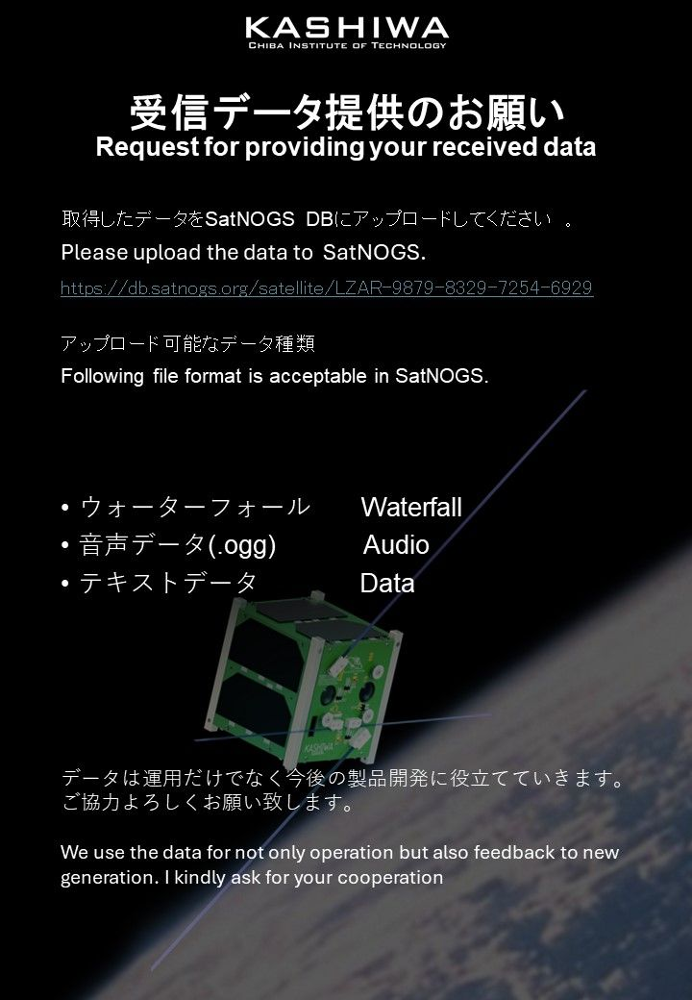
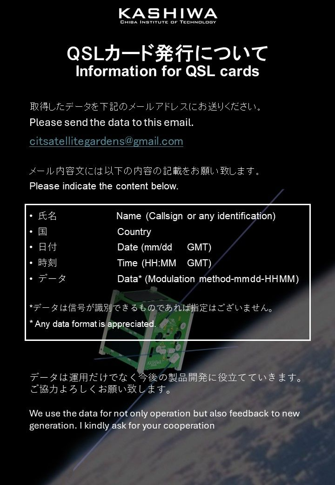

**注意！以下内容翻译自 [KASHIWA团队](https://twitter.com/CitGardens) 的 [Tweets](https://twitter.com/CitGardens/status/1778243738638434802)**

**********

## 1. 请将收到的数据上传至SatNOGS（见左侧附件）。

左侧附件：

请将获取到的数据上传到SatNOGS：  
https://db.satnogs.org/satellite/LZAR-9879-8329-7254-6929

可以上传的数据类型：

频谱数据  
音频数据（.ogg格式）  
文本数据（您所解码出来的内容）  

## 2. 如果您还想申请QSL卡，请将数据发送到提供的电子邮件地址（见右侧附件）。

右侧附件：

请将数据发送到此邮箱：citsatellitegardens@gmail.com

请在邮件内容中标明如下内容：

您的姓名/呼号（或其他称呼）  
您的国家  
日期（mm/dd，月/日，以GMT为基准）  
时刻（HH:MM，小时/分钟，以GMT为基准）  
数据（调制方式-月日-小时分钟）  

欢迎提供各种数据格式！

您提供的数据不仅用于操作运营卫星，也将用于未来的开发研究之中，感谢您的帮助！

**********

## 附件：

  
  