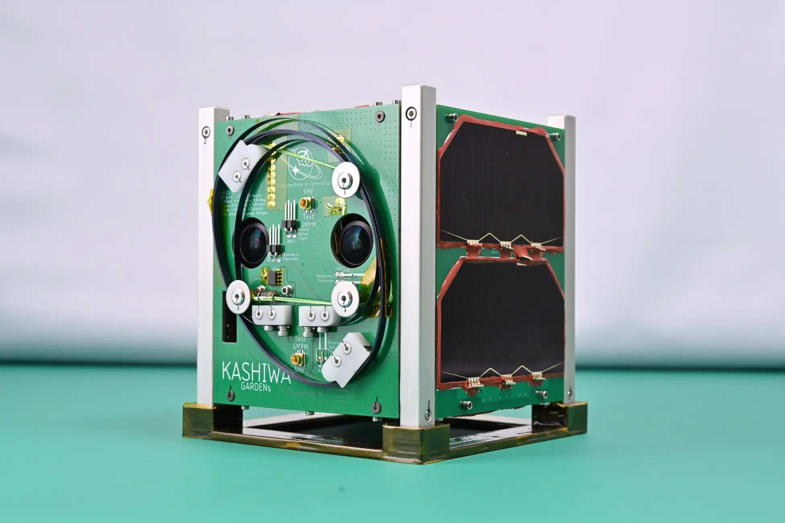
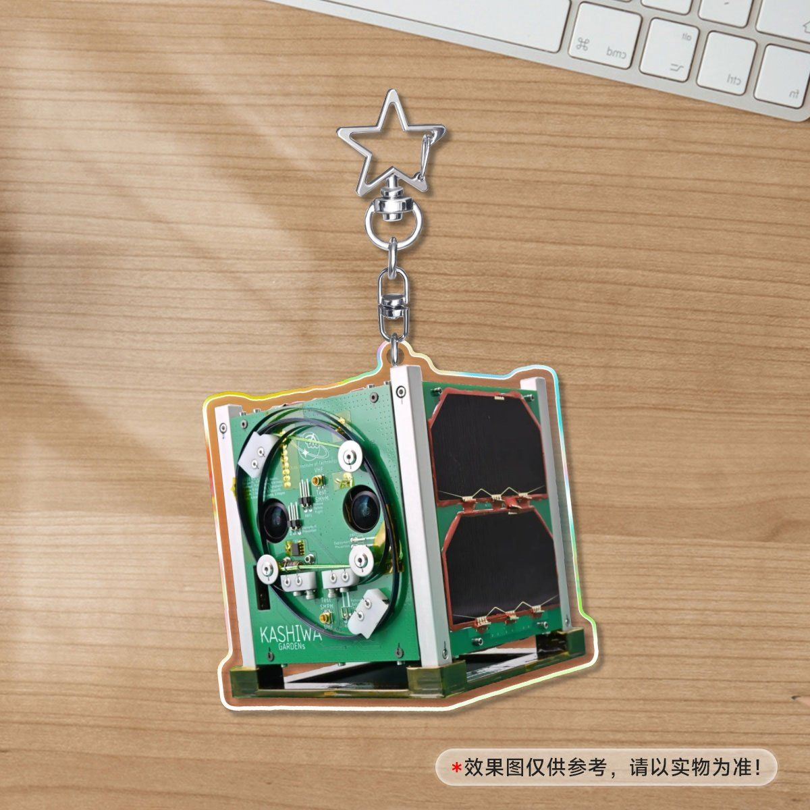
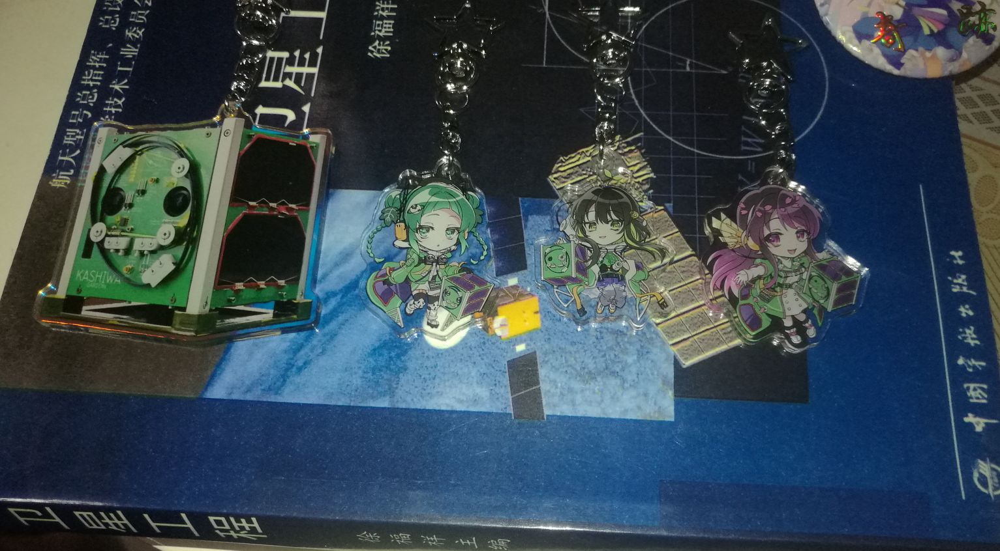
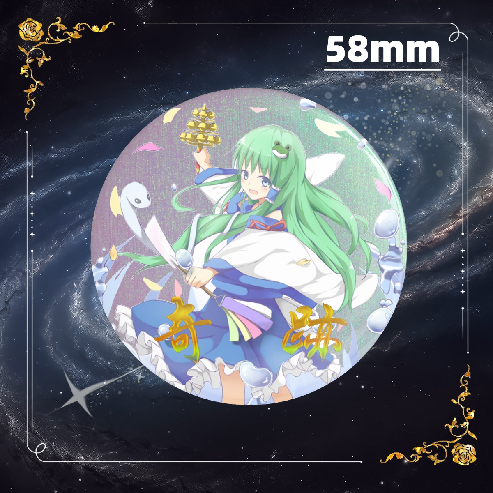
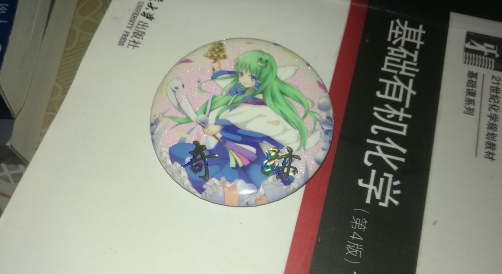

## 千葉工業大学 超小型衛星

我试着做了「KASHIWA（柏）」（一颗由千叶工业大学制造的CubeSat，于2024年春进入太空）的亚克力挂件~

它在设计上，比制作拟人化的挂件更粗鲁，我直接使用了PhotoShop把它抠出来了，哈哈🤣

总而言之，我真的很喜欢千叶工业大学的卫星，它们的设计真的很棒，看起来很精致！ 

附上一些图片:

 

我还是一如既往的不会摄影呢～～实物图右边的卫星拟人挂件出自于画师「庭サークル（Niwa_circle）」，如果你感兴趣的话可以在她的BOOTH购买到这些挂件。

************

在Twitter上的千葉工業大学 超小型衛星プログラム [GARDENs](https://twitter.com/CitGardens)
在Twitter上的卫星拟人画师 [庭サークル](https://twitter.com/niwa_circle)

## 奇跡の早苗

「奇跡を起こす程度の能力」

你一定知道我是苗厨吧（盯）
如果你不知道，还不快去看看我的个人简介（怒）！

这个吧唧也算是我为我自己设计的吧（当然图片来源于Pixiv）。

其实做这个吧唧，主要是为了————「奇迹」。
我以信仰祈求奇迹的诞生，但终究化作虚幻。可是人总是要有信仰，人总是会祈求着奇迹的诞生。做这个吧唧，也算是表达我自己对「奇迹」的一种期盼与祝愿吧。
当然，我也知道“奇跡はあくまで偶然の頂点であり、その結果が良い方とも悪い方とも限らない”，但是，我仍祈求着「奇迹」的发生。

也没有什么好说的啦，直接上图吧~

 

************

在Pixiv上的原图：[奇跡を起こす程度の能力](https://www.pixiv.net/artworks/46111711)

